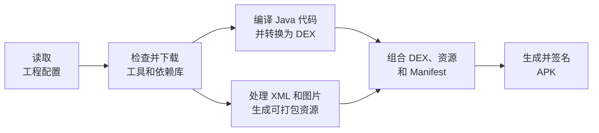
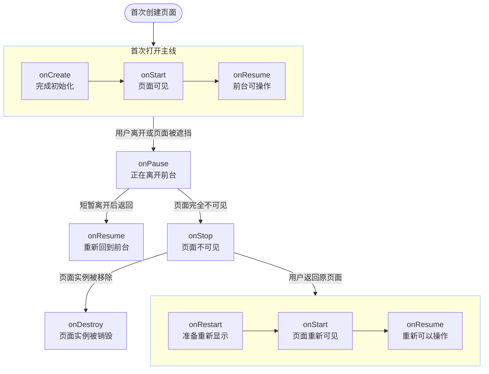

# 《安卓逆向负基础之正向开发实践》01：MuzicBox 项目规划与工程创建

> 本章对应版本：`v0.1-plan-and-project`  
> 项目仓库：[D1screteWave/MuzicBox](https://github.com/D1screteWave/MuzicBox)
> 内容状态：初版开发笔记
> 开发语言：Java 17  
> 界面方案：XML View  
> 本章成果：一个可以编译安装的最小 Android 应用

## 0. 七篇开发笔记路线

MuzicBox 会用七篇笔记记录从最小工程到发布构建的完整过程。每一篇都会在上一版本的代码上继续开发，并围绕实际功能认识相关知识：

| 章节 | 涉及的知识点 |
| --- | --- |
| 01：项目规划与工程创建 | 工程结构、Gradle、Activity、Manifest、XML 资源、Intent 和生命周期 |
| 02：本地音乐扫描与基础播放 | 运行时权限、MediaStore、ContentResolver、音乐列表和基础播放控制 |
| 03：后台音乐播放与 Service | Service、前台服务、通知栏控制、BroadcastReceiver 和音频焦点 |
| 04：在线音乐播放与网络请求 | SharedPreferences、网络权限、HTTP 接口、服务器地址配置和流媒体播放 |
| 05：用 JNI 实现参数签名 | NDK、JNI、Native 方法、so 文件、参数签名和服务端校验 |
| 06：基础反调试与 Frida 检测 | 调试状态检测、进程特征、Frida 痕迹和安全对抗边界 |
| 07：R8 混淆、签名与加壳实验 | R8 的代码压缩、优化与混淆，应用签名、完整性校验和加壳前后对比 |

各章的功能目标、知识点和版本标签可以在仓库根目录的 [`ROADMAP.md`](../../ROADMAP.md) 中查看。

## 1. 为什么先做一个播放器

### 1.1 用一个完整项目串起零散知识

只看零散语法，很难知道它们在项目里有什么用；直接照抄复杂项目，出错后又无从定位。因此，这组笔记每次只完成一小块真实功能，再从中认识 Activity、Service、权限和网络请求等知识。

### 1.2 为什么选择音乐播放器

MuzicBox 选择“极简音乐播放器”作为主线，是因为它能自然串起 Android 的核心知识：

- 扫描本地音乐会用到权限、`MediaStore` 和 `ContentResolver`；
- 播放界面会用到 Activity、XML、事件与生命周期；
- 后台播放会用到 Service、通知、音频焦点和 BroadcastReceiver；
- 在线音乐会用到网络、配置持久化和接口设计；
- JNI 签名、反调试、R8 与加壳又能把正向开发和安全分析连接起来。

### 1.3 第一章只完成地基

第一章暂不编写播放代码，而是先建立一个结构清楚、能够编译运行的 Android 工程。后面加入音乐扫描、后台播放和网络请求前，需要先弄清工程怎样构建、页面怎样启动，以及代码怎样找到界面。

完成本章后，至少应该能够回答：Android 工程的 Java、XML 和 Manifest 分别在哪里？点击桌面图标后系统怎样找到首页？`MainActivity` 又是怎样把 XML 界面显示出来的？

## 2. 先确定边界，而不是先堆功能

### 2.1 项目的核心目标

MuzicBox 的第一版需求如下：

1. 扫描手机里的音频文件；
2. 支持播放、暂停、上一首和下一首；
3. 支持后台播放和通知栏控制；
4. 允许用户填写自己的服务器地址并播放在线音频；
5. 在后续章节使用 JNI 实现参数签名，并加入基础安全实践。

这些功能会按依赖关系逐步完成：先扫描和播放本地音乐，再处理后台播放；先完成在线请求，再使用 JNI 实现参数签名。

### 2.2 当前明确不做什么

暂时不做歌词、账号、评论、歌单同步、拖动进度、复杂播放模式等功能。每次更新只集中完成一组相互关联的功能，并说明新增了什么、为什么这样实现。

范围越小，越容易判断问题来自界面、权限、播放器还是网络，也更容易验证本次修改是否生效。

## 3. 创建工程时的关键选择

### 3.1 先确定语言和界面方式

本项目选择 Java + XML：Java 负责程序逻辑，XML 负责描述界面。这样可以继续使用正在学习的 Java，同时认识 Android 传统 View 界面的基本组成。

第一阶段先减少同时出现的新知识；等 Java 版本稳定后，再对照 Kotlin 理解两种语言的差异。

### 3.2 Android 版本怎样理解

先区分三个容易混在一起的名称：

- **Android 系统版本**：用户设备上看到的版本名称，例如 Android 8.0、Android 16；
- **API 级别**：系统功能的数字编号，例如 API 26、API 36。它没有独立文件，而是出现在项目配置和设备的 `Build.VERSION.SDK_INT` 中；
- **SDK Platform**：开发者安装到电脑、供项目编译使用的实际 SDK 包，其中包含 `android.jar` 等文件。

API 级别相当于共同的版本标尺。例如 MuzicBox 设置 `minSdk = 26` 后，API 25 的设备不能安装，API 26 及以上的设备才满足最低要求。SDK Platform 则提供该版本真正用于编译的接口文件，例如 SDK Platform 36.1 以 API 36 为基础。

Android 系统版本号和 API 级别不能用简单公式互相推导。大版本通常先有一个基础 API 级别，后续功能版本可能再增加 API 级别或 SDK 平台小版本：

```text
Android 8.0   → API 26
Android 12 / 12L → API 31 / 32
Android 16    → 基础 API 36
Android 16 QPR2 → SDK Platform 36.1
```

MuzicBox 的三个版本字段都在 [`app/build.gradle`](../../app/build.gradle) 中：`minSdk` 决定最低安装版本，`targetSdk` 决定按哪一代系统规则适配，`compileSdk` 选择编译所用的 SDK Platform。

```groovy
android {
    compileSdk {
        version = release(36) {
            minorApiLevel = 1
        }
    }

    defaultConfig {
        minSdk = 26
        targetSdk = 36
    }
}
```

其中 `compileSdk` 直接位于 `android` 内，另外两个字段位于 `defaultConfig` 内。`release(36)` 与 `minorApiLevel = 1` 共同选择 SDK Platform 36.1，而 `targetSdk` 仍填写基础 API 级别 `36`。

完整对应关系可查 [SDK Platform 版本说明](https://developer.android.com/tools/releases/platforms)；36.1 的配置可查 [Android 16 QPR2 SDK 配置说明](https://developer.android.com/about/versions/16/qpr2/setup-sdk)。

### 3.3 本项目的环境基线

本项目使用以下基线：

| 项目 | 选择 | 原因 |
| --- | --- | --- |
| 语言 | Java | 面向刚开始学习 Java 的 Android 初学者 |
| 界面 | XML View | 先理解传统 Android 视图、资源与 Activity 的关系 |
| 最低版本 | API 26 / Android 8.0 | 降低早期兼容代码的干扰 |
| 编译版本 | SDK Platform 36.1 / Android 16 QPR2 | 决定编译时可使用的 Android API |
| 目标版本 | API 36 / Android 16 | 作为当前项目的系统行为适配基线 |
| 构建插件 | AGP 9.2.1 | 与当前 Android Studio 和 Gradle 版本匹配 |
| Gradle | 9.4.1 | AGP 9.2 的兼容版本 |

这些版本用于固定开发环境。遇到构建差异时，应先确认工具版本是否一致。

### 3.4 为什么会看到两个 Java 版本

这里容易混淆两种 Java 版本：

- Android Studio Runtime 负责运行 Gradle 和 Android 构建工具，本项目的构建环境使用 Java 21；
- `sourceCompatibility` 和 `targetCompatibility` 决定项目源码采用的 Java 语言级别，本项目设为 Java 17。

它们承担的角色不同，因此“构建工具运行在 Java 21 上，源码按 Java 17 编译”并不冲突。

## 4. 看懂最小工程结构

### 4.1 先找到最重要的目录

刚打开 Android 工程时，左侧会出现许多文件。第一步不是把所有文件都记住，而是先回答三个问题：Java 代码放在哪里？界面放在哪里？应用从哪里启动？

先忽略构建工具自动产生的目录，第一章真正需要认识的结构如下：

```text
MuzicBox/
├─ app/
│  ├─ build.gradle
│  ├─ proguard-rules.pro
│  └─ src/main/
│     ├─ AndroidManifest.xml
│     ├─ java/io/github/d1scretewave/muzicbox/
│     │  └─ MainActivity.java
│     └─ res/
│        ├─ drawable/
│        ├─ layout/activity_main.xml
│        └─ values/
├─ docs/
├─ gradle/wrapper/
├─ build.gradle
├─ gradle.properties
├─ gradlew
├─ gradlew.bat
├─ settings.gradle
└─ ROADMAP.md
```

`MuzicBox` 根目录代表整个工程，`app` 是其中负责生成安装包的应用模块，Java 源码只是该模块的一部分。可以用两条关系式记住这种包含关系：

```text
MuzicBox 工程 = 工程配置 + 构建工具文件 + 项目文档 + app 模块
app 模块 = 模块配置 + Java 源码 + 界面资源 + AndroidManifest.xml
```

MuzicBox 目前只有 `app` 一个模块，暂时不用研究多模块工程。

### 4.2 `app/src/main` 中分别放什么

进入 `app/src/main` 后，文件分工就比较直观了：

| 位置 | 当前内容 | 它负责什么 |
| --- | --- | --- |
| `java/.../MainActivity.java` | Java 代码 | 页面创建后要做什么 |
| `res/layout/activity_main.xml` | XML 布局 | 页面上有哪些控件、如何排列 |
| `res/values/strings.xml` | 文本资源 | 集中保存应用名称和界面文案 |
| `res/values/colors.xml` | 颜色资源 | 集中保存界面颜色 |
| `res/drawable/` | 图形资源 | 保存背景形状和图标 |
| `AndroidManifest.xml` | 应用清单 | 告诉系统应用有哪些组件、从哪个页面启动 |

暂时只需要记住：**Java 管行为，XML 管界面，Manifest 管登记。**

### 4.3 Gradle 到底是做什么的

#### 4.3.1 从工程内容到 APK

Java、XML、图片和 Manifest 是项目的原始内容，手机不能直接安装。下面的流程图说明构建系统怎样处理这些内容并生成 APK；它描述的是开发阶段的构建过程，不是 App 在手机上的运行过程。



DEX 是 Android 设备执行的代码格式；XML 会被编译为运行时可读取的资源数据，图片会经过校验或优化，资源名称和编号则进入资源表。图中的两条分支表示代码与资源采用不同的处理方式，并不表示它们始终同时执行。

各框省略的主语都是“Android 构建系统”：Gradle 负责任务组织和执行顺序，Android Gradle Plugin（AGP）及相关工具负责 Android 专用的编译、资源处理、打包和签名。

#### 4.3.2 构建过程中名称带有 Gradle 的四类角色

构建配置和日志中经常出现四个相似名称，但它们的性质和职责不同：

| 名称 | 本身是什么 | 怎样参与当前工程 | 本项目中的作用 |
| --- | --- | --- | --- |
| Gradle（Gradle 构建工具） | 通用的自动化构建工具，也是实际运行构建任务的程序 | 由项目中的 Wrapper 启动，然后读取各级 Gradle 配置 | 组织任务、处理任务依赖并执行构建流程 |
| Android Gradle Plugin（AGP，Android Gradle 插件） | Google 提供的 Gradle 插件 | 由项目在 `build.gradle` 中声明，在构建时由 Gradle 加载 | 为 Gradle 注册 Android 专用任务，使其能够编译 Android 代码、处理资源并生成 APK |
| Gradle Wrapper（Gradle 启动与版本管理文件） | 随项目保存的一组启动脚本和版本配置 | 通过 `gradlew` 或 `gradlew.bat` 启动，并按配置准备指定版本的 Gradle | 让 MuzicBox 固定使用约定的 Gradle 9.4.1 |
| Gradle 工程配置（Gradle 构建说明） | 使用 Gradle 语法编写的项目配置文件 | 由 `settings.gradle`、根目录 `build.gradle` 和模块 `build.gradle` 等文件组成，再由 Gradle 读取 | 描述工程包含哪些模块、使用哪些插件，以及各模块应当怎样构建 |

前三项是构建时使用的程序或组件，第四项是它们读取的说明：

```text
Wrapper → 启动指定版本的 Gradle

Gradle + AGP + Gradle 工程配置 → 完成 Android 项目构建
```

AGP 让通用的 Gradle 学会处理 Android 的 Manifest、资源和 APK；工程配置则说明 MuzicBox 使用哪些版本和构建选项。

#### 4.3.3 四类角色与项目文件的对应关系

Wrapper 和工程配置直接保存在仓库中；Gradle 程序与 AGP 会按声明的版本下载到开发环境：

```text
Gradle Wrapper = gradlew + gradlew.bat + gradle/wrapper/gradle-wrapper.properties + gradle/wrapper/gradle-wrapper.jar

Gradle 工程配置 = settings.gradle + 根目录 build.gradle + app/build.gradle
```

第一组负责“用哪个 Gradle、怎样启动”，第二组负责“工程包含什么、怎样构建”。在 Windows 下执行 `gradlew.bat` 后，Wrapper 启动指定版本的 Gradle；Gradle 再读取配置并加载 AGP。

`build/` 和 `.gradle/` 保存构建产物或缓存，`local.properties` 记录本机 SDK 路径，它们都不是应用源码。

### 4.4 Gradle 工程配置

接下来查看项目用哪些文件告诉 Gradle“怎样构建”。

#### 4.4.1 `settings.gradle`：声明工程和模块

这个文件告诉构建工具：项目叫 MuzicBox，目前包含一个名为 `app` 的模块：

```groovy
rootProject.name = "MuzicBox"
include(":app")
```

`include(":app")` 表示把 `app` 加入工程；只有文件夹而没有这项声明，Gradle 不会构建该模块。

#### 4.4.2 `build.gradle`：配置工程和应用模块

MuzicBox 当前有两处 `build.gradle`：一处位于工程根目录，另一处位于 `app/build.gradle`。它们名称相同，但负责的配置范围不同。

根目录的 `build.gradle` 主要确定整个工程使用哪个 Android 构建插件：

```groovy
plugins {
    id "com.android.application" version "9.2.1" apply false
}
```

`app/build.gradle` 则描述 MuzicBox 这个 App 怎样构建，例如最低支持哪个 Android 版本、当前版本号是多少、Java 使用哪个版本。以后添加播放器或网络库时，也会在这里声明依赖。

可以先把 `app/build.gradle` 理解为“App 的构建说明书”。

## 5. Manifest：系统如何知道从哪里启动

### 5.1 先认识 Manifest 的整体结构

写好 `MainActivity.java` 后，系统还不知道它是启动页面。Android 通过 `AndroidManifest.xml` 了解应用的名称、图标、权限、组件和入口。

文件最外层是 `<manifest>`；权限声明和 `<application>` 都位于其中。`<application>` 保存应用公共配置，并在内部登记 Activity、Service 等组件：

```text
<manifest>                         整份应用清单
├─ <uses-permission>               应用需要的权限（按需加入）
└─ <application>                   应用公共配置与组件范围
   ├─ <activity>                   页面组件
   └─ <service>                    服务组件（后续加入）
```

本节只沿着“系统怎样找到首页”这条主线，查看与 `MainActivity` 启动有关的部分。

### 5.2 阅读 Activity 的登记内容

#### 5.2.1 先看完整的 Activity 登记

其中与启动有关的内容如下：

```xml
<activity
    android:name=".MainActivity"
    android:exported="true">
    <intent-filter>
        <action android:name="android.intent.action.MAIN" />
        <category android:name="android.intent.category.LAUNCHER" />
    </intent-filter>
</activity>
```

#### 5.2.2 先认识 XML 的标签和属性

Manifest 使用 XML 格式。`<activity>` 是标签，表示一种内容；`android:name=".MainActivity"` 是属性，用来补充说明该标签。

这里反复出现的 `android:` 也有来源。Manifest 最外层的 `<manifest>` 标签中包含下面这项声明：

```xml
<manifest xmlns:android="http://schemas.android.com/apk/res/android">
```

`xmlns:android` 声明了 `android` 这个名称前缀，因此后面可以使用 `android:name`、`android:icon` 等 Android 属性。网址用于标识这套属性，不表示构建时要访问网页。

#### 5.2.3 拆开两条较长的标准名称

两行较长的配置可以这样拆开：

```xml
<action android:name="android.intent.action.MAIN" />
<category android:name="android.intent.category.LAUNCHER" />
```

第一行中，`action` 是标签，`android:name` 是属性，`android.intent.action.MAIN` 是完整的属性值；行尾 `/>` 表示标签在这里结束。

属性值 `android.intent.action.MAIN` 又可以分成两部分理解：

```text
android.intent.action  +  MAIN
动作名称所使用的前缀       具体动作：作为主要入口启动
```

第二行结构相同，只是标签改为 `category`：

```text
android.intent.category  +  LAUNCHER
类别名称所使用的前缀         具体类别：可由桌面启动器发现
```

前缀用来区分“动作”和“类别”，末尾的 `MAIN`、`LAUNCHER` 指出具体类型；合起来才是 Android 能识别的标准名称。这些点不是 Java 方法调用。

#### 5.2.4 把整段登记内容串起来

先按从外到内的顺序阅读：

1. `<activity>` 表示这里登记了一个 Activity 页面。
2. `android:name=".MainActivity"` 表示这个页面对应 `MainActivity` 类。
3. `<intent-filter>` 表示这个页面愿意接收哪一类启动请求。
4. `<action android:name="android.intent.action.MAIN" />` 声明要匹配的动作；末尾的 `MAIN` 表示把这个 Activity 作为应用的主要入口启动。
5. `<category android:name="android.intent.category.LAUNCHER" />` 补充入口的类别；末尾的 `LAUNCHER` 表示桌面启动器可以发现并显示这个入口。
6. `android:exported="true"` 表示桌面启动器能够从应用外部启动它。

`.MainActivity` 是类名简写，完整名称是 `io.github.d1scretewave.muzicbox.MainActivity`。`intent-filter` 列出 Activity 能匹配的请求条件，`action` 和 `category` 是两类条件。系统看到该 Activity 同时具有 `MAIN + LAUNCHER` 后，才知道点击桌面图标时应打开它；本文将这个首先打开的页面简称为“首页”。

### 5.3 点击图标后发生了什么

可以先把 `Intent` 理解为一张“要做什么”的消息单：桌面启动器请求打开应用入口，系统查阅 Manifest，找到匹配 `MAIN + LAUNCHER` 的 `MainActivity`。

完整启动过程可以简化为：


Intent 表达启动请求，Manifest 指明入口，`MainActivity` 执行页面代码，XML 提供界面结构。

### 5.4 应用配置、组件和权限放在哪里

`<application>` 内登记 Activity、Service 等组件；MuzicBox 目前只有 `MainActivity`，后台播放的 Service 将在第三章加入。

权限位置不同：`<uses-permission>` 写在 `<manifest>` 内、`<application>` 外。第一章尚未读取音乐或访问网络，因此暂不声明相关权限；第二章会结合系统版本处理音频读取权限。

## 6. Activity、XML 和资源如何配合

### 6.1 Activity 怎样显示第一份布局

系统根据 Manifest 找到 `MainActivity` 后，会创建这个 Activity。Activity 可以先理解为“显示界面并响应操作的页面组件”。页面第一次创建时，系统调用 `onCreate`：

```java
public class MainActivity extends Activity {
    @Override
    protected void onCreate(Bundle savedInstanceState) {
        super.onCreate(savedInstanceState);
        setContentView(R.layout.activity_main);
    }
}
```

逐行理解这段代码：

- `extends Activity` 表示 `MainActivity` 在普通 Java 类的基础上，继承了 Android 页面具备的能力；
- `@Override` 表示下面的方法正在重写从 `Activity` 继承而来的生命周期方法；
- `Bundle savedInstanceState` 是系统传入的页面状态信息，本章暂时没有读取它；
- `super.onCreate(...)` 先让 Activity 完成系统规定的基础创建工作；
- `setContentView(...)` 再指定这个页面使用哪一份 XML 布局；
- `R.layout.activity_main` 代表 `res/layout/activity_main.xml`。

### 6.2 为什么把界面拆成 XML 和资源

XML 适合描述控件的层级和排列，Java 负责点击、数据和播放逻辑：

| 内容 | 放置位置 | 示例 |
| --- | --- | --- |
| 页面结构 | `activity_main.xml` | 页面中有标题、说明文字和按钮 |
| 界面文案 | `strings.xml` | `MuzicBox`、按钮文字 |
| 颜色 | `colors.xml` | 背景色、主题色 |
| 用户操作 | `MainActivity.java` | 点击按钮后显示提示 |

### 6.3 `R` 是资源索引

`res` 中的布局、字符串和颜色不是普通 Java 变量。构建工具会为资源生成编号，并通过自动生成的 `R` 类供 Java 引用。`R` 像一份按类型分组的资源目录：

```text
R.layout.activity_main  →  res/layout/activity_main.xml
R.string.app_name       →  strings.xml 中的 app_name
R.color.brand           →  colors.xml 中的 brand
R.id.button_roadmap     →  XML 中 ID 为 button_roadmap 的控件
```

这些名称最终对应构建工具分配的整数编号，但编写代码时不需要记住具体数字。

#### 6.3.1 `R` 实际存在于哪里

`R` 不在源码目录中。它由 Android Gradle Plugin 根据资源生成，属于 `app/build` 下的构建产物。当前 Debug 构建可以看到：

```text
app/build/intermediates/compile_symbol_list/debug/generateDebugRFile/R.txt
app/build/intermediates/compile_r_class_jar/debug/generateDebugRFile/R.jar
```

`R.txt` 记录资源符号，`R.jar` 包含编译时使用的 `R` 类。不同 AGP 版本可能调整目录，因此代码不应依赖这些路径。旧教程常提到 `R.java`，现代工具也可能直接生成编译后的类和 JAR，没有在源码目录看到它很正常。

本项目的完整 `R` 类名是 `io.github.d1scretewave.muzicbox.R`。`android.R` 指向系统资源，不要误导入。`R` 由构建工具维护；若 `R.xxx` 标红，应检查资源名和 XML 语法，而不是修改生成文件。

### 6.4 Java 怎样找到 XML 中的按钮

XML 使用下面的写法给按钮创建 ID：

```xml
android:id="@+id/button_roadmap"
```

Java 加载布局后，再使用同一个 ID 找到这个按钮对象：

```java
Button roadmapButton = findViewById(R.id.button_roadmap);
```

因此顺序不能颠倒：先用 `setContentView` 加载 XML，再用 `findViewById` 查找其中的控件。如果还没有加载布局，Java 就找不到那个按钮。

### 6.5 点击事件、Context 和界面单位

找到按钮后，还需要告诉程序“用户点击时做什么”。本章注册了一个点击监听器，并显示一条短提示：

```java
roadmapButton.setOnClickListener(new View.OnClickListener() {
    @Override
    public void onClick(View view) {
        Toast.makeText(
                MainActivity.this,
                R.string.roadmap_toast,
                Toast.LENGTH_SHORT
        ).show();
    }
});
```

`setOnClickListener` 把监听器交给按钮；用户点击后，Android 调用其中的 `onClick`。`Toast` 是短暂文字提示，`MainActivity.this` 是它需要的 `Context`，现阶段可把 Context 理解为“当前应用环境”。

最后再认识两个界面单位：控件大小和间距通常使用 `dp`，文字大小通常使用 `sp`。`sp` 还会跟随用户设置的字体大小变化，因此比直接写固定像素更适合显示文字。

## 7. 用日志观察 Activity 生命周期

### 7.1 为什么页面会有生命周期

用户按 Home 键、切换 App、返回页面或旋转屏幕时，Activity 的状态会变化。Android 会调用一组固定方法通知代码：页面正在创建（`onCreate`）、已经可见（`onStart`）、可以操作（`onResume`），或者正在离开（`onPause`、`onStop`）。这组过程就是 Activity 生命周期。

#### 7.1.1 先看第一次打开的主线

第一次打开 MuzicBox 时，先看下面这条主线：


起点是用户操作，不是生命周期回调；后面依次表示“创建页面 → 页面可见 → 页面可操作”。

#### 7.1.2 有了主线后，再看完整关系

页面进入 `onResume` 后，不同用户操作会触发不同路径：

| 用户操作 | 常见回调顺序 | 用中文理解 |
| --- | --- | --- |
| 页面只是短暂被遮挡，随后马上回来 | `onPause → onResume` | 暂时不能操作，又重新回到前台 |
| 按 Home 键或切换到其他 App | `onPause → onStop` | 先失去前台位置，然后完全看不见 |
| 从后台回到原来的页面 | `onRestart → onStart → onResume` | 准备重新显示，然后重新变得可见、可操作 |
| 按返回键结束当前页面 | `onPause → onStop → onDestroy` | 页面离开，并且当前页面实例被销毁 |

把这些情况放回一张图，就能看到分支和返回路线：



先横向读完顶部主线，再从 `onPause` 向下选择分支。图中重复的 `onStart` 和 `onResume` 只是为了单独画清返回路径。`onRestart` 表示原页面准备再次显示；如果页面已被系统结束，则可能重新从 `onCreate` 开始。`onDestroy` 也不是保证执行的“应用退出通知”。

### 7.2 每个回调分别表示什么

普通方法通常由我们主动调用；回调则是先按 Android 的规则写好，等特定事情发生后由系统调用。`MainActivity` 重写 `onCreate`、`onStart` 等方法，就是在规定页面进入相应状态时要执行什么；应用代码通常不直接调用它们。

每个方法可以结合“用户现在看到什么”来理解：

| 回调 | 页面状态 | 当前适合做什么 |
| --- | --- | --- |
| `onCreate` | 页面实例刚创建 | 加载布局、寻找控件、准备初始数据 |
| `onStart` | 页面已经可见 | 准备与“可见”相关的工作 |
| `onResume` | 页面位于前台，可操作 | 接收用户输入、恢复交互 |
| `onPause` | 页面正在失去前台位置 | 暂停只应在前台进行的工作 |
| `onStop` | 页面已经不可见 | 停止不再需要的界面更新 |
| `onRestart` | 已停止的页面准备重新显示 | 恢复重新显示前需要完成的准备 |
| `onDestroy` | 当前页面实例将被销毁 | 清理与这个页面实例直接相关的内容 |

### 7.3 日志怎样帮助我们观察

只看屏幕，很难知道系统调用了哪个方法。`Log.d(...)` 中的 `d` 是 debug（调试）的缩写，它向系统日志写入调试信息，不会在 App 页面显示。把它放进生命周期回调后，系统每次调用该回调都会留下记录；Android Studio 的 Logcat 负责显示这些日志。

代码先定义统一的日志标签，再在回调中调用 `Log.d`：

```java
private static final String TAG = "MuzicBoxLifecycle";

Log.d(TAG, "onCreate: 主界面已创建");
```

`Log` 来自 `android.util.Log`；`TAG` 是自定义分类，便于筛选；第二个参数是实际消息。`private static final` 可先理解为“统一保存且不再修改的日志标签”。实际顺序是：系统调用 `onCreate` → Java 执行其中的代码 → `Log.d` 写入日志。

### 7.4 自己动手观察一次

运行 App 后，在 Logcat 中选择当前设备和 MuzicBox 进程，再搜索 `MuzicBoxLifecycle`。可以依次实验：

1. 第一次打开 App，观察 `onCreate → onStart → onResume`。
2. 按 Home 键，观察 `onPause → onStop`。
3. 从最近任务返回 App，观察 `onRestart → onStart → onResume`。
4. 按返回键退出或旋转屏幕，观察页面销毁与重新创建。

### 7.5 生命周期和音乐播放有什么关系

Activity 只是页面实例，不等于整个 App。播放任务若完全依附 Activity，页面离开后就难以稳定继续；第三章会用 Service 处理“页面可以离开，音乐仍需播放”。

## 8. 四大组件先建立地图

### 8.1 为什么 Android 要划分组件

Android 应用并非简单地从一个 `main` 方法运行到底：页面可由桌面启动器打开，播放可由通知控制，系统事件也可能在页面隐藏时到来。因此，Android 将常见能力划分为由系统管理的组件。

### 8.2 四种组件分别解决什么问题

Android 常说的四大组件包括：

| 组件 | 主要职责 | MuzicBox 中何时使用 |
| --- | --- | --- |
| Activity | 展示界面并处理用户交互 | 本章的主界面 |
| Service | 执行不依附单个页面的持续任务 | 第 03 章后台播放 |
| BroadcastReceiver | 接收系统或应用广播事件 | 第 03 章耳机、音频与播放控制事件 |
| ContentProvider | 以统一接口提供结构化数据 | 第 02 章通过系统 MediaStore 间接使用 |

第二章通过 `ContentResolver` 查询系统的 `MediaStore`，相当于间接使用 ContentProvider，暂不需要自己编写 Provider。Service 的后台限制和 BroadcastReceiver 的事件场景会在第三章结合播放功能说明。

### 8.3 第一章只真正使用 Activity

第一章只真正创建 Activity，其余组件只建立位置感。等业务需要出现时再实现，比为了“凑齐四大组件”硬塞空类更容易理解。

## 9. 构建和验证

### 9.1 同步、构建和运行不是一回事

Android Studio 中经常出现三个容易混淆的动作：

| 动作 | 实际作用 | 能否证明 App 已运行 |
| --- | --- | --- |
| Gradle Sync | 读取构建配置并准备插件、依赖 | 不能 |
| Build / Assemble | 编译代码并生成 APK | 不能，只能证明成功生成安装包 |
| Run | 构建、安装到设备并启动 | 可以进一步验证实际界面和交互 |

因此，同步成功不等于编译成功，编译成功也不等于真机功能一定正常。

### 9.2 看懂本章的构建命令

在 Android Studio 中打开仓库根目录并等待同步后，可以通过界面构建，也可以在 Windows 终端执行：

```powershell
.\gradlew.bat :app:assembleDebug
```

这条命令可以拆成三部分：

- `.\gradlew.bat`：使用项目自带的 Gradle Wrapper；
- `:app`：指定要构建 `app` 模块；
- `assembleDebug`：生成用于开发调试的 Debug APK。

成功后，APK 位于：

```text
app/build/outputs/apk/debug/app-debug.apk
```

### 9.3 本章的检查结果

当前代码已经完成以下检查：

- `assembleDebug`：成功生成 Debug APK；
- `lintDebug`：检查通过。Lint 是静态检查工具，它会在不运行 App 的情况下寻找常见代码、资源和配置问题。

## 10. 本章练习

### 10.1 先练习找到代码位置

1. 找到首页的 Java、XML 和 Manifest 文件，分别说出它们的作用。
2. 在 `strings.xml` 中找到应用副标题，再从布局中找到引用这个字符串的位置。
3. 在 XML 中找到 `button_roadmap`，再从 Java 中找到同一个 ID 被读取的位置。

### 10.2 再练习修改和观察

1. 修改 `strings.xml` 中的副标题，重新构建并观察变化。
2. 修改一个颜色资源，确认引用该颜色的位置是否一起变化。
3. 点击路线按钮，观察 Toast，说明监听器、`onClick` 和 Toast 的关系。
4. 在 Logcat 中记录第一次打开、按 Home、重新进入和返回退出时的生命周期顺序。
5. 旋转屏幕并观察 Activity 是否被重新创建。

### 10.3 本章自检

不看原文，尝试用自己的话回答：

- Gradle、AGP、Gradle Wrapper 和 Gradle 工程配置分别负责什么？
- Manifest、Intent 和 Activity 怎样共同完成应用启动？
- XML 中的按钮怎样被 Java 找到？
- `onCreate`、`onResume` 和 `onStop` 分别表示什么状态？

## 11. 小结与下一章

### 11.1 本章建立了哪张知识地图

这一章没有堆功能，但完成了后续所有工作的地基：

- 明确了项目范围与七篇开发笔记路线；
- 建立了 Java + XML 工程，并认识了 Gradle、AGP、Wrapper 与工程配置的分工；
- 认识了模块、Manifest、资源、Activity、Context 和 Intent；
- 对四大组件建立了业务地图；
- 用构建和 Lint 留下可验证的检查结果。

遇到问题时，可以按位置排查：界面结构看 XML，交互行为看 Java，启动登记看 Manifest，构建问题看 Gradle 配置和 Build 输出。

### 11.2 下一章会新增什么

下一章将读取手机中的本地音频，并实现播放、暂停、上一首和下一首。届时会自然遇到运行时权限、音乐列表和播放器状态。

`MediaStore` 可以先理解为系统维护的媒体文件目录，`ContentResolver` 是查询入口；具体代码、权限差异和数据字段留到实际扫描时说明。

## 参考资料

- [Android 应用基础知识](https://developer.android.com/guide/components/fundamentals)
- [Activity 生命周期](https://developer.android.com/guide/components/activities/activity-lifecycle)
- [应用清单概览](https://developer.android.com/guide/topics/manifest/manifest-intro)
- [Android 构建系统概览](https://developer.android.com/build)
- [Android Gradle Plugin 9.2 版本说明](https://developer.android.com/build/releases/agp-9-2-0-release-notes)
