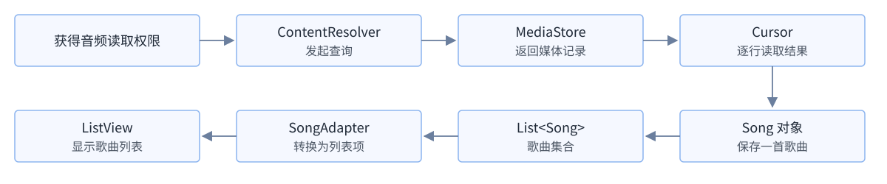
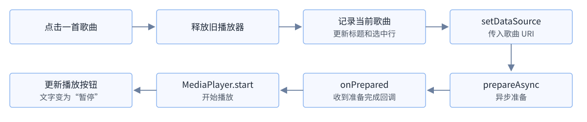
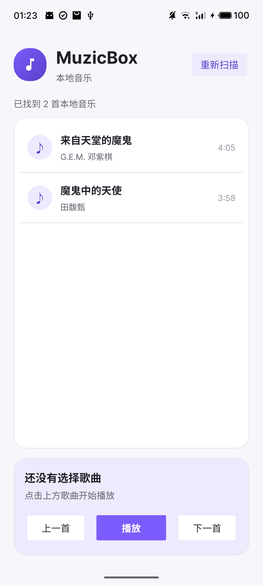

# 《安卓逆向负基础之正向开发实践》02：MuzicBox 本地音乐扫描与基础播放

> 项目仓库：[D1screteWave/MuzicBox](https://github.com/D1screteWave/MuzicBox)
> 本章对应版本：`v0.2-local-player`
> 内容状态：初版开发笔记
> 开发语言：Java 17
> 界面方案：XML View
> 本章成果：扫描系统媒体库，并实现播放、暂停、上一首和下一首

## 0. 本章在整体路线中的位置

第一章建立了可以编译运行的 Android 工程，认识了 Activity、Manifest、XML 资源和生命周期。本章开始读取手机中的本地音乐，并把选中的歌曲交给系统播放器。

本章围绕播放器功能，学习下面几组 Android 系统机制：

| 学习角度 | 本章观察位置 |
| --- | --- |
| 权限 | Manifest 声明、系统版本分支、运行时授权回调 |
| 系统数据 | ContentProvider、MediaStore、Cursor、content URI |
| 文件输入 | MP3 标签、常见音频格式、外部元数据 |
| 线程与回调 | 工作线程、主线程、MediaPlayer 异步回调 |
| 生命周期 | Activity 停止、播放器与线程资源释放 |
| 界面与代码 | 资源 ID、事件入口、`setDataSource` 调用点 |

本章既会阅读 Manifest、代码和资源文件，也会结合真机运行结果观察权限、数据和播放状态怎样变化。

## 1. 本章目标与数据路径

### 1.1 功能范围

本章完成以下功能：

1. 根据 Android 版本申请音频读取权限；
2. 查询系统媒体库并显示歌曲信息；
3. 点击歌曲后开始播放；
4. 支持播放、暂停、上一首和下一首；
5. 页面离开前台后停止播放。

后台播放、通知栏控制和耳机事件留到第三章处理。当前播放器仍由 `MainActivity` 管理，本章先学习权限、媒体数据和播放器调用链。

### 1.2 从系统媒体库到歌曲列表

本章的数据从系统媒体库进入 MuzicBox，最后显示为歌曲列表：



图中几个关键对象的来源和形式如下：

| 名称 | 来源 | Java 形式 | 本章作用 | 关键代码 |
| --- | --- | --- | --- | --- |
| `ContentResolver` | Android 框架 | 抽象类；Android 返回对象 | 发起媒体库查询 | `contentResolver.query(...)` 发起查询 |
| `ContentProvider` | Android 框架 | 抽象组件类；系统实现，本章间接访问 | 接收查询并提供系统媒体数据 | 无直接调用，由 `ContentResolver` 间接访问 |
| `Cursor` | Android 框架 | 接口；查询返回实现对象 | 保存查询结果并逐行读取记录 | `cursor.moveToNext()` 移动，`cursor.getString()` 读取 |
| content URI | Android 框架 | `Uri` 对象；本章生成 | 定位媒体集合或具体歌曲 | `ContentUris.withAppendedId(...)` 生成歌曲 URI |
| `Song` | MuzicBox 项目 | 普通类；项目定义并创建 | 保存一首歌曲的信息 | `new Song(...)` 封装一条歌曲记录 |
| `ListView` | Android 框架 | 界面类；布局创建，本章取得 | 在页面上显示歌曲列表 | `findViewById(R.id.list_songs)` 取得列表对象 |

### 1.3 APK 中的版本标识

第二章加入了本地音乐功能，因此应用版本也从第一章继续向前更新。版本信息配置在 `app/build.gradle` 的 `defaultConfig` 中：

```groovy
defaultConfig {
    versionCode = 2
    versionName = "0.2.0"
}
```

`versionCode` 是 Android 和应用商店比较版本先后的整数，数值 `2` 表示它晚于上一版的 `1`。
`versionName` 是供用户识别的版本名称，本章使用 `0.2.0`。
构建 APK 后，系统的应用信息页面或应用商店可以读取并显示这个 `versionName`；MuzicBox 的主界面不会自动显示它，如果以后要在“关于”页面中显示，还需要用代码读取应用包信息并设置到文字控件中。
两者由开发者分别维护，不会自动换算；构建 APK 时，它们都会写入应用包信息。

## 2. Android 音频权限机制

### 2.1 Manifest 声明与运行时授权

本章在 `AndroidManifest.xml` 中声明两项权限：

```xml
<uses-permission android:name="android.permission.READ_MEDIA_AUDIO" />

<uses-permission
    android:name="android.permission.READ_EXTERNAL_STORAGE"
    android:maxSdkVersion="32" />
```

`<uses-permission>` 位于 `<manifest>` 内、`<application>` 外，描述的是整个应用包可能使用的系统能力，而不是某一个 Activity 的属性。安装 APK 时，系统会先从 Manifest 读取这些声明。

Manifest 声明表示 App 可能使用这项系统能力；读取用户媒体还需要在运行时取得授权。两者关系可以概括为：

```text
Manifest 声明 = 应用提前登记需要什么能力
运行时授权   = 用户决定本次是否允许
```

只有声明而没有运行时授权，扫描仍可能失败；Manifest 中完全没有声明，代码也无法通过弹窗取得相应权限。

### 2.2 为什么要声明两种音频权限

上一节同时声明两种权限，是因为 Android 13（API 33）调整了媒体读取权限：Android 13 及以上读取音频使用 `READ_MEDIA_AUDIO`，Android 12 及以下使用 `READ_EXTERNAL_STORAGE`。

Manifest 负责把两种情况都提前声明出来，App 运行时还要根据当前手机的 Android 版本选择其中一种。下面的 `getAudioPermission()` 方法来自 `MainActivity.java`，它只返回本次应该使用的权限名称，真正的检查和申请会在下一节调用这个方法。

```java
private String getAudioPermission() {
    if (Build.VERSION.SDK_INT >= Build.VERSION_CODES.TIRAMISU) {
        return Manifest.permission.READ_MEDIA_AUDIO;
    }
    return Manifest.permission.READ_EXTERNAL_STORAGE;
}
```

`Build.VERSION.SDK_INT` 是当前设备的 API 级别，`TIRAMISU` 对应 API 33。这里判断的是 App 实际运行的系统版本，不是项目的 `compileSdk`。

Manifest 中的 `android:maxSdkVersion="32"` 则把旧权限限制在 API 32 及以下。同一份 APK 因此可以在不同系统版本上选择不同权限路径。

这也说明静态看到两个权限并不等于运行时会同时申请两个权限。还需要结合设备 API 级别和 `getAudioPermission()` 的返回值，才能确定当前路径真正使用了哪个权限常量。

### 2.3 检查、申请与结果回调

下面三个方法都来自 `MainActivity.java`，依次负责检查权限、发起申请和接收结果。首先检查当前状态：

```java
private boolean hasAudioPermission() {
    return checkSelfPermission(getAudioPermission())
            == PackageManager.PERMISSION_GRANTED;
}
```

`checkSelfPermission(...)` 只检查，不会弹出窗口。已经授权时直接扫描，否则调用 `requestPermissions(...)`：

```java
private void checkPermissionAndScan() {
    if (hasAudioPermission()) {
        scanLocalMusic();
        return;
    }

    requestPermissions(
            new String[]{getAudioPermission()},
            REQUEST_AUDIO_PERMISSION
    );
}
```

权限窗口由系统显示，用户操作后，系统再调用 `onRequestPermissionsResult`：

```java
@Override
public void onRequestPermissionsResult(
        int requestCode,
        String[] permissions,
        int[] grantResults
) {
    super.onRequestPermissionsResult(requestCode, permissions, grantResults);

    if (requestCode != REQUEST_AUDIO_PERMISSION) {
        return;
    }

    if (grantResults.length > 0
            && grantResults[0] == PackageManager.PERMISSION_GRANTED) {
        scanLocalMusic();
    } else {
        scanStatusText.setText(R.string.permission_denied);
    }
}
```

`requestCode` 用来区分不同请求，`grantResults` 保存对应授权结果。这是一条异步链路：申请方法不会直接返回用户最终选择，后续逻辑从系统回调继续执行。

实际调试时可以依次观察三个位置：

1. 调用 `requestPermissions` 前传入的权限名称；
2. 系统回调中的 `requestCode`；
3. `grantResults[0]` 的实际值。

这样能够区分“没有申请”“用户拒绝”和“授权成功但后续功能仍失败”三类情况。

### 2.4 梳理完整的权限调用链

理解权限机制不能停在 Manifest 声明，还要继续查看运行时分支：

```text
Manifest 是否声明
    ↓
设备版本选择了哪个权限常量
    ↓
checkSelfPermission 返回什么
    ↓
用户允许或拒绝
    ↓
onRequestPermissionsResult 进入哪个分支
    ↓
敏感功能是否继续执行
```

阅读代码可以确认权限常量、版本判断和可能的执行路径；真机运行则可以确认当前设备实际选择了哪个权限，以及拒绝权限后功能是否停止。

权限失败分支同样值得检查。如果拒绝后仍能进入 `scanLocalMusic()`，或者敏感功能还存在没有权限检查的第二入口，就不能只根据主流程判断权限控制有效。

## 3. MediaStore 与 ContentProvider 数据链

### 3.1 为什么查询媒体库而不是遍历文件夹

现代 Android 对共享存储访问进行了限制，音乐也不一定只位于某个固定目录。系统媒体扫描器会维护一份媒体索引，记录音频的 ID、标题、歌手和时长等信息，应用通过 `MediaStore` 查询这份索引。

`MediaStore` 并不是另一份歌曲文件。文件已经复制进手机但尚未被媒体扫描器登记时，存储中虽然存在文件，查询结果却可能暂时看不到它。

### 3.2 四个核心对象

| 名称 | 作用 |
| --- | --- |
| `MediaStore` | 定义媒体集合 URI、字段名称和分类 |
| `ContentProvider` | 在系统侧管理并提供媒体数据 |
| `ContentResolver` | 代表当前 App 发起查询 |
| `Cursor` | 保存查询结果并支持逐行读取 |

content URI 以 `content://` 开头，由 ContentProvider 解析。它不是互联网网址，也不一定等于真实文件路径。

`ContentResolver` 和 ContentProvider 位于调用链两侧：前者是 App 使用的统一访问入口，后者在系统侧管理并提供数据。MuzicBox 没有自己实现 Provider，而是调用系统媒体 Provider。

```text
ContentResolver.query(MediaStore URI, 查询条件)
    ↓
系统媒体 ContentProvider 执行查询
    ↓
返回 Cursor
```

### 3.3 查询字段与筛选条件

本节代码摘自 `LocalMusicScanner.java` 的 `scan(...)` 方法，只保留查询相关的核心部分。首先确定音频集合：

```java
Uri collection = MediaStore.Audio.Media.EXTERNAL_CONTENT_URI;
```

`projection` 决定查询返回哪些列：

```java
String[] projection = {
        MediaStore.Audio.Media._ID,
        MediaStore.Audio.Media.TITLE,
        MediaStore.Audio.Media.ARTIST,
        MediaStore.Audio.Media.DURATION
};
```

四个字段分别承担不同作用：

- `_ID` 用来构造具体歌曲的 content URI；
- `TITLE` 和 `ARTIST` 最终显示在界面；
- `DURATION` 用来显示歌曲时长并过滤无效记录。

只查询实际使用的列，可以让返回结果更明确。阅读 `projection` 也能直接看出应用关注哪些媒体属性。

筛选条件保留系统认定为音乐且时长有效的记录，排序规则按标题升序排列：

```java
String selection = MediaStore.Audio.Media.IS_MUSIC + " != 0"
        + " AND " + MediaStore.Audio.Media.DURATION + " > 0";
String sortOrder = MediaStore.Audio.Media.TITLE + " COLLATE NOCASE ASC";
```

- `IS_MUSIC != 0` 排除系统没有认定为音乐的其他音频；
- `DURATION > 0` 排除时长无效的记录；
- `TITLE ... ASC` 按标题升序排列；
- `COLLATE NOCASE` 表示比较英文标题时不区分大小写。

最后发起查询：

```java
Cursor cursor = contentResolver.query(
        collection,
        projection,
        selection,
        null,
        sortOrder
);
```

`ContentResolver.query` 的五个参数依次是：

1. `collection`：查询位置；
2. `projection`：返回字段；
3. `selection`：筛选条件；
4. `selectionArgs`：筛选参数；
5. `sortOrder`：排序规则。

从这些实参可以直接确认 App 读取了哪些字段，又主动排除了哪些记录。

这里第四个参数为 `null`，是因为 `selection` 没有使用 `?` 占位符。如果查询条件包含外部输入，更需要同时检查筛选字符串与筛选参数怎样组合，避免只看最终 SQL 风格字符串而忽略数据来源。

### 3.4 从 Cursor 记录生成歌曲 URI

下面仍是 `scan(...)` 中的核心逻辑，负责把 Cursor 记录转换为 `Song`。Cursor 刚返回时没有指向具体记录，`moveToNext()` 每次移动到下一行，返回 `false` 时表示读取完毕：

```java
while (cursor.moveToNext()) {
    long id = cursor.getLong(idColumn);
    String title = cursor.getString(titleColumn);
    String artist = cursor.getString(artistColumn);
    long duration = cursor.getLong(durationColumn);

    Uri songUri = ContentUris.withAppendedId(collection, id);
    songs.add(new Song(id, title, artist, duration, songUri));
}
```

读取字段前，代码会通过 `getColumnIndexOrThrow` 根据字段名取得列位置，再调用 `getLong` 或 `getString` 读取当前行。Cursor 的列顺序由查询结果决定，因此不应把列下标当作永远固定的数字。

媒体库的 `_ID` 是记录标识，不是文件路径。`ContentUris.withAppendedId` 把 ID 追加到集合 URI，形成某一首歌的地址：

```text
媒体集合：content://media/external/audio/media
歌曲 ID：1000000813
歌曲 URI：content://media/external/audio/media/1000000813
```

MediaPlayer 之后通过这个 URI 请求系统打开音频。Cursor 使用完需要关闭，本项目用 try-with-resources 完成清理。

Cursor 到 `Song` 的转换位置是数据汇合点：标题、歌手、时长和 URI 在这里第一次被整理为应用自己的结构。继续跟踪 `songUri`，就能从系统媒体记录走到最终的播放入口。

## 4. 音频文件、元数据与可信边界

### 4.1 测试 MP3 中保存了什么

音频文件除了声音数据，还可以携带标题、歌手、专辑和封面等元数据。MP3 常用 ID3 标签保存这些信息，一个标签帧对应一类字段。

读取两首测试 MP3 自身的 ID3 元数据后，可以看到它们都包含 ID3v2.4 标签：

| 文件 | 实际发现的关键标签 |
| --- | --- |
| `来自天堂的魔鬼-邓紫棋.mp3` | `TIT2=来自天堂的魔鬼`、`TPE1=G.E.M. 邓紫棋`、`TALB=新的心跳`、`TCON=Blues`、`TRCK=4/10`、`TPOS=1/1`，并带有 `APIC` 封面 |
| `魔鬼中的天使-田馥甄.mp3` | `TIT2=魔鬼中的天使`、`TPE1=田馥甄`、`TSSE=Lavf57.71.100` |

上表中的标签缩写含义如下：

| ID3 帧 | 常见含义 |
| --- | --- |
| `TIT2` | 歌曲标题 |
| `TPE1` | 主要歌手或表演者 |
| `TALB` | 专辑名称 |
| `TRCK` | 曲目序号 |
| `TCON` | 流派 |
| `APIC` | 内嵌图片，通常是封面 |
| `TSSE` | 编码或生成文件所用的软件信息 |

Android 媒体扫描器读取标签后，将能识别的信息写入 MediaStore。MuzicBox 查询的是 `TITLE` 和 `ARTIST`，因此真机界面中的歌手名来自媒体记录，而不是代码截取文件名。

文件名也包含歌手并不能证明 App 使用了文件名。更直接的证据是：文件内部存在 `TPE1`，系统把它解析为 MediaStore 的 `ARTIST`，而 App 查询的正是这个字段。

### 4.2 MP3 文件的基本组成

MP3 文件可以粗略分成标签信息和音频帧两部分：

```text
[可选 ID3v2 标签]
    ├─ 标题、歌手、专辑等文本帧
    └─ 可选封面图片等二进制帧

[一系列 MPEG Audio Frame]
    └─ 经过压缩的音频数据

[可选 ID3v1 标签]
    └─ 位于文件尾部的旧式标签
```

查看本章两个文件开头的原始字节时，`49 44 33` 对应字符 `ID3`，之后可以看到 `TIT2`、`TPE1` 等帧标识。ID3 标签帧负责描述歌曲，MPEG Audio Frame 才是声音主体。

时长不一定保存在标签中，媒体扫描器或解码器也可以根据音频帧等信息计算。因此，“标题能被识别”和“时长能被识别”可能来自不同解析过程。

### 4.3 常见音频格式对比

编码负责压缩和还原声音；容器负责组织音频、元数据等内容。扩展名只能作为线索，不能代替对文件结构的判断。

| 扩展名 | 音频与容器关系 | 常见元数据位置 |
| --- | --- | --- |
| `.mp3` | MPEG Audio 帧组成主体 | ID3v2 或 ID3v1 |
| `.flac` | FLAC 无损音频流，由 STREAMINFO、其他元数据块和音频帧组成 | VORBIS_COMMENT、PICTURE |
| `.m4a` | 常见为 ISO BMFF/QuickTime 容器，音频可能是 AAC 或 ALAC | `moov`、`meta`、`ilst` 等 box/atom，媒体数据通常位于 `mdat` |
| `.ogg` | Ogg 是容器，常承载 Vorbis 或 Opus | Vorbis Comment 或 OpusTags |
| `.wav` | 常见为 RIFF/WAVE 容器，内部多见 PCM | `fmt ` 描述格式，`data` 保存音频，元数据支持并不统一 |

判断文件格式时应结合文件头、结构字段和解码信息，不能只相信扩展名。

例如 `.m4a` 更接近容器名称，内部既可能是 AAC，也可能是 ALAC；`.ogg` 也不等于某一种固定编码。伪造扩展名不会自动改变文件内部结构，系统最终仍要根据实际内容解析。

### 4.4 外部元数据为什么不能直接信任

音频文件属于外部输入，可能出现下面的问题：

- 标题长度异常；
- 文本编码异常；
- 内嵌封面过大；
- 结构中声明的长度与真实内容不一致。

即使主要解析工作交给 MediaStore 和 MediaPlayer，应用仍然不应默认信任返回文本和图片。

开发时既要关注 Java 层如何处理标题和封面，也要注意输入何时进入系统媒体扫描器或底层解码器。前者可能造成界面异常、内存压力或业务逻辑问题，后者则涉及更复杂的文件解析过程。

这些外部数据主要沿下面两条路径进入界面和播放器：

```text
音频文件字节
    ↓ 系统媒体扫描与格式解析
MediaStore 字段
    ↓ Cursor 读取
Song 对象
    ↓ Adapter 绑定
界面文字

歌曲 content URI
    ↓ MediaPlayer.setDataSource
系统媒体解析与解码
```

这条链把文件解析过程和应用业务连接起来。排查问题时，可以依次检查三个边界：

1. 音频文件进入系统解析器；
2. MediaStore 字段进入 Java 对象；
3. content URI 进入播放器。

## 5. 跨线程扫描与异步回调

`ExecutorService` 是 Java 提供的任务执行器，`runOnUiThread()` 是 Activity 切回主线程的方法。下面的代码摘自 `MainActivity.java` 的 `scanLocalMusic()`：查询在工作线程执行，列表更新回到主线程完成。

```java
scanExecutor.execute(() -> {
    List<Song> scannedSongs =
            LocalMusicScanner.scan(getContentResolver());

    runOnUiThread(() -> {
        songs.clear();
        songs.addAll(scannedSongs);
        songAdapter.notifyDataSetChanged();
    });
});
```

其中 `songs` 保存扫描结果，`songAdapter.notifyDataSetChanged()` 通知列表重新显示数据。执行顺序如下：

```text
主线程提交扫描任务
    ↓
工作线程执行 ContentResolver.query
    ↓
MediaStore 返回 Cursor，构造 List<Song>
    ↓
runOnUiThread 把结果交回主线程
    ↓
列表刷新
```

这意味着“点击扫描”和“列表出现数据”不在同一条同步调用栈上。调试时，任务提交到执行器后，需要转到工作线程观察 `LocalMusicScanner.scan`，再跟到主线程回调。

`scanExecutor.execute(...)` 只负责提交任务，并不在按钮点击方法中同步完成扫描。调试器如果只停留在点击监听器的调用栈上，通常会在任务提交后失去后续查询，需要切换线程继续观察。

Activity 也可能在扫描完成前销毁。代码在更新界面前检查 `isFinishing()` 和 `isDestroyed()`，并在 `onDestroy()` 中关闭执行器，避免延迟回调继续引用失效页面。

这个时间差是异步代码常见的稳定性问题：任务开始时页面有效，不代表结果返回时页面仍然有效。除了正常结果，还要检查三种情况是否都会进入清理路径：

- 查询发生异常；
- 扫描任务被中断；
- 页面已经销毁。

`Song` 和 Adapter 在这里只承担数据转交：Cursor 记录被整理为 `Song`，Adapter 再把字段显示到列表。理解数据来源时，应继续向上查看 Cursor 和 MediaStore，而不是停在 TextView。

## 6. MediaPlayer 调用链与生命周期

`MediaPlayer` 是 Android 框架提供的媒体播放类，会与系统音频服务和底层解码组件协作。它的主要状态变化依次是：

1. 创建播放器对象；
2. 设置数据源；
3. 准备音频；
4. 播放或暂停；
5. 释放播放器资源。

这类对象不能把所有方法按任意顺序调用。例如，尚未设置数据源时不能直接开始播放，调用 `release()` 后也不能继续复用原实例。排查播放器问题时，除了看某个方法是否出现，还要结合调用顺序判断当时状态是否合法。

### 6.1 从点击歌曲到开始播放

下图对应 `MainActivity.playSong(position)` 的主要执行路径：



列表点击事件提供 `position`，`playSong(position)` 再通过 `songs.get(position)` 取得 `Song` 和 content URI。调用 `prepareAsync()` 后，播放器在准备完成时回调 `onPrepared`，随后执行 `start()`。

因此，`prepareAsync → onPrepared` 是异步分界线；`Song.getUri() → setDataSource` 则是业务对象进入系统播放器的数据边界。

流程图最后更新按钮文字只是界面反馈，真正开始播放的调用仍然是 `MediaPlayer.start()`。判断应用是否已经播放时，应查看播放器方法和状态，而不是只看按钮文本。

### 6.2 设置数据源并异步准备

下面是 `playSong(...)` 中创建播放器、设置歌曲 URI 并等待准备完成的核心片段：

```java
MediaPlayer newPlayer = new MediaPlayer();
mediaPlayer = newPlayer;
newPlayer.setDataSource(this, song.getUri());

newPlayer.setOnPreparedListener(player -> {
    isPreparing = false;
    player.start();
    playPauseButton.setText(R.string.pause);
});

newPlayer.prepareAsync();
```

Activity 本身也是 Context，因此可以传入 `this`，让 MediaPlayer 通过系统解析 content URI。`setDataSource` 只指定播放来源；`prepareAsync()` 负责异步读取媒体信息并准备解码。

`setDataSource(Context, Uri)` 是本章最重要的数据汇合点。无论标题怎样显示、列表位置怎样变化，本地歌曲最终都要以 URI 形式进入这个方法。第三章以后加入网络来源时，也可以从相近的播放器入口比较本地 URI 与网络 URL 的去向。

如果使用同步 `prepare()`，调用线程会一直等待准备完成。异步准备更适合界面程序，调试相关问题时也要继续查看监听器回调。

### 6.3 完成、错误与关键观察点

`playSong(...)` 还会为 MediaPlayer 注册监听器，用来接收播放完成和播放错误事件：

```java
newPlayer.setOnCompletionListener(player -> playNext());

newPlayer.setOnErrorListener((player, what, extra) -> {
    Log.e(TAG, "MediaPlayer error: what=" + what + ", extra=" + extra);
    releasePlayer();
    Toast.makeText(this, R.string.playback_failed, Toast.LENGTH_SHORT).show();
    return true;
});
```

自然播放结束进入 `OnCompletionListener`。下面几种情况可能进入 `OnErrorListener`：

- 数据源已经损坏；
- 音频格式不受支持；
- URI 无法打开；
- 媒体记录已经失效。

`what` 和 `extra` 是排查具体错误的重要运行时参数。

错误路径同样需要释放播放器并恢复可操作状态。只检查成功回调，会遗漏格式异常、权限被撤回、媒体记录失效等情况下的资源和状态问题。

| 观察位置 | 可以确认什么 |
| --- | --- |
| `playSong(int position)` | 列表位置怎样变成 `Song` |
| `Song.getUri()` | 业务层最终选中的 URI |
| `MediaPlayer.setDataSource(Context, Uri)` | 真正交给播放器的数据源 |
| `OnPreparedListener` | 异步准备何时完成 |
| `OnErrorListener` | 解析、权限或格式错误进入哪条路径 |
| `releasePlayer()` | 正常与异常路径是否释放资源 |

### 6.4 Activity 生命周期与资源释放

`releasePlayer()` 位于 `MainActivity.java`，切换歌曲或离开页面时用它释放播放器：

```java
private void releasePlayer() {
    isPreparing = false;
    if (mediaPlayer != null) {
        mediaPlayer.reset();
        mediaPlayer.release();
        mediaPlayer = null;
    }
}
```

`reset()` 恢复初始状态，`release()` 释放底层资源。只把 Java 引用设为 `null` 不能代替 `release()`。

Java 变量只保存对象引用，而 MediaPlayer 背后还会占用系统音频服务和底层资源。主动调用 `release()` 才表示不再使用这些资源；切歌前释放旧实例，也能避免旧回调影响新歌曲。

本章没有 Service，播放器仍然属于 `MainActivity`。同一文件中的 `onStop()` 会在页面不可见后停止播放，`onDestroy()` 会在页面实例销毁时关闭扫描执行器：

```java
@Override
protected void onStop() {
    super.onStop();
    releasePlayer();
}

@Override
protected void onDestroy() {
    releasePlayer();
    scanExecutor.shutdownNow();
    super.onDestroy();
}
```

资源管理不仅要看对象在哪里创建，还要确认下面几条路径能否到达释放代码：

- 用户切换歌曲；
- 播放过程发生错误；
- 用户按下返回键；
- Activity 页面销毁。

MediaPlayer 背后包含系统服务和 Native 媒体组件，遗漏释放不只是一个 Java 变量问题。

`onStop()` 表示页面已经不可见，但应用进程不一定结束；`onDestroy()` 表示当前 Activity 实例即将销毁。本章在两个阶段都执行清理，是因为播放和扫描任务当前都依附这个页面实例。

### 6.5 为什么下一章需要 Service

Activity 适合管理可见页面，不适合独立承担锁屏、切换 App 后仍要继续的播放任务。第三章会把持续播放交给 Service，让 Activity 负责显示状态和发送控制指令。

## 7. 资源 ID 如何连接界面与代码

XML 中的控件 ID 会生成对应的 `R.id.xxx`。从资源 ID 可以继续定位 Java 中的事件监听器和业务方法：

| 资源 ID | 界面含义 | Java 中的去向 |
| --- | --- | --- |
| `button_scan` | 重新扫描 | `checkPermissionAndScan()` |
| `list_songs` | 歌曲列表 | 点击后调用 `playSong(position)` |
| `button_previous` | 上一首 | `playPrevious()` |
| `button_play_pause` | 播放或暂停 | `togglePlayPause()` |
| `button_next` | 下一首 | `playNext()` |
| `text_current_title` | 当前歌曲名 | `updateCurrentSong(song)` |

源码中可以搜索 `R.id.xxx`；构建后的 APK 中还会保存布局 XML、资源 ID 和 `resources.arsc`。`resources.arsc` 是编译后的资源表，记录资源 ID、名称和值之间的对应关系。

阅读界面相关代码时，可以先在布局中确定控件 ID，再搜索 `findViewById` 或事件监听器。找到控件变量后，继续查看：

- `setOnClickListener`：控件点击后执行什么；
- `setAdapter`：列表从哪里取得数据；
- `setText`：界面文字由谁更新。

把这些调用连接起来，才能理解完整业务路径。

界面文字还可能来自 `strings.xml`、MediaStore 或运行时状态，单看布局文件无法确认最终内容。阅读资源的目标不应停在控件样式，还要继续找到对应的权限、查询和播放入口。

## 8. 真机结果、代码练习与小结

### 8.1 构建与真机结果

Debug APK 构建和 Android Lint 检查通过。测试时将两首 MP3 放入手机的 `Music/MuzicBox` 目录，并让系统媒体扫描器更新 MediaStore，最终识别到：

| 歌曲 | 歌手 | 时长 |
| --- | --- | --- |
| 来自天堂的魔鬼 | G.E.M. 邓紫棋 | 4:05 |
| 魔鬼中的天使 | 田馥甄 | 3:58 |

权限允许后，MuzicBox 能够显示两首歌曲并完成播放控制；页面离开前台后停止播放。



### 8.2 代码阅读与运行观察练习

1. 从 Manifest 和版本判断代码确认 API 32 与 API 33 分别请求哪个权限。
2. 从 `MediaStore.Audio.Media.ARTIST` 追踪歌手名进入 Cursor、`Song` 和界面的路径。
3. 沿 `MediaPlayer.setDataSource` 的参数来源找到 content URI 的构造位置。
4. 记录点击扫描后主线程、工作线程和主线程回调之间的切换。
5. 记录 `position → Song → Uri → setDataSource` 的实际参数变化。
6. 查看一份 MP3 的文件头，确认 `ID3`、`TIT2` 和 `TPE1`。
7. 修改测试文件的标题标签并重新扫描，观察 MediaStore 与界面变化。
8. 列出播放器创建和释放路径，检查异常分支是否遗漏资源释放。

这些练习可以直接使用 MuzicBox 和自己准备的音频文件完成。

### 8.3 本章小结

本章建立了两条核心链路：

```text
音频文件与标签 → 系统媒体扫描 → MediaStore → Cursor → Song

Song 的 content URI → MediaPlayer.setDataSource → 系统解析与播放
```

围绕这两条链路，又观察了权限分支、跨线程回调、资源 ID 和 Activity 生命周期。下一章将加入 Service、通知栏控制、音频焦点和 BroadcastReceiver，把播放任务从页面生命周期中分离出来。

## 参考资料

- [请求运行时权限](https://developer.android.com/training/permissions/requesting)
- [访问共享存储中的媒体文件](https://developer.android.com/training/data-storage/shared/media)
- [MediaStore.Audio.Media](https://developer.android.com/reference/android/provider/MediaStore.Audio.Media)
- [ContentResolver](https://developer.android.com/reference/android/content/ContentResolver)
- [Cursor](https://developer.android.com/reference/android/database/Cursor)
- [MediaPlayer 基础](https://developer.android.com/media/platform/mediaplayer/basics)
- [ID3v2.4 标签结构](https://id3.org/id3v2.4.0-structure)
- [ID3v2.4 常见帧定义](https://id3.org/id3v2.4.0-frames)
- [FLAC 文件格式概览](https://www.xiph.org/flac/documentation_format_overview.html)
- [Vorbis I 格式规范](https://www.xiph.org/vorbis/doc/Vorbis_I_spec.pdf)
- [QuickTime / M4A 的 atom 结构](https://developer.apple.com/documentation/quicktime-file-format/atoms)
- [RIFF/WAVE 结构](https://learn.microsoft.com/windows/win32/xaudio2/resource-interchange-file-format--riff-)
